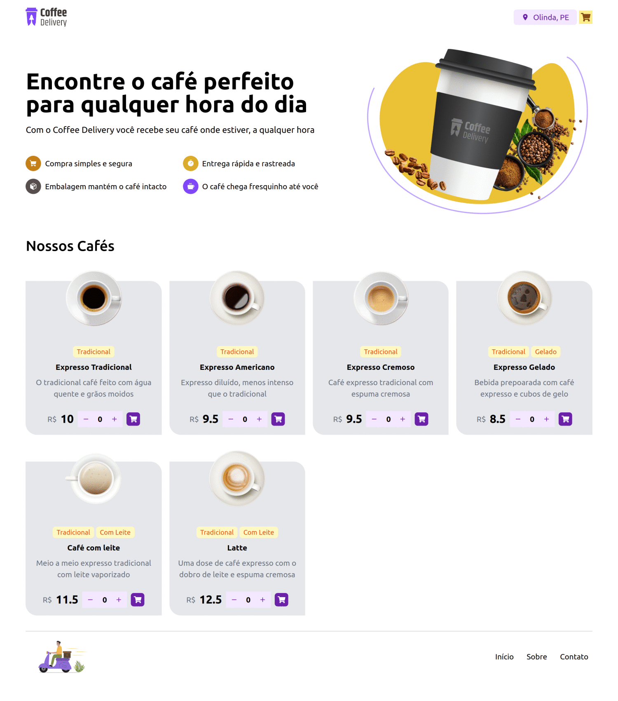

# Coffee Delivery

## Aplicativo desenvolvido para gerenciar um carrinho de compras de uma cafeteria.

#### Funcionalidades:

- Listagem de cafés disponíveis para compra
- Adicionar uma quantidade específicas de itens no carrinho
- Aumentar ou remover a quantidade de itens no carrinho
- Formulário para o usuário preencher o seu endereço
- Exibir o total de itens no carrinho no Header
- Exibir o valor total da soma de itens no carrinho multiplicados pelo valor

Developer by: **Brenno - Dev Meditation**

- [Link para testar o projeto - Coffee Delivery](https://coffee-delivery-bcl.netlify.app/)

## TECHS and LIBS
- [vite](https://vitejs.dev/)
- [tailwindCSS](https://tailwindcss.com/)
- [react-router-dom](https://reactrouter.com/en/main)
- [react-hook-form](https://react-hook-form.com/)
- [@hookform/resovers](https://github.com/react-hook-form/resolvers)
- [zod](https://zod.dev/)

### CONTACT

- [Youtube](https://www.youtube.com/@bcllab)